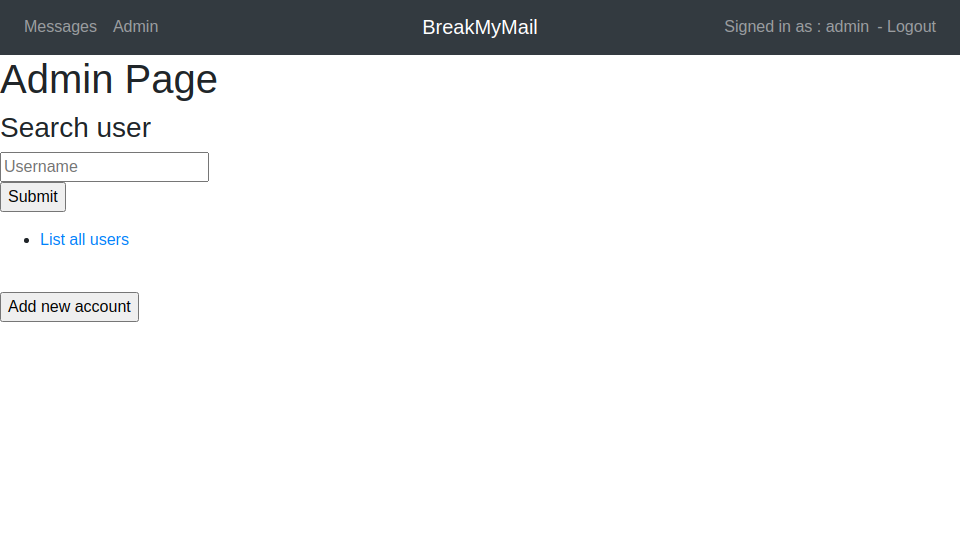
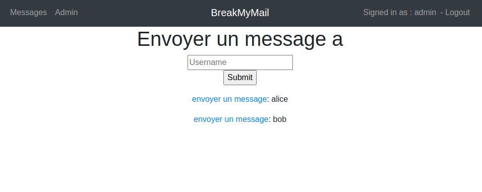

## BreakMyMail - Web Mail Application 

Auteur : Gaëtan Daubresse, Quentin Saucy 

### Installation  

Pour démarrer l'application nous avons utilisé `docker-compose` ce changement est dû au fait que nous avons dû changé les images utilisées et nous en avons profiter pour mettre en place ce service. Cela facilite la gestion de l'application. 

- Pour démarrer 

  ```sh
  docker-compose up --build
  ```

- Pour arrêter 

  ```sh
  docker-compose down
  ```

### Utilisation 

##### Login 

La page de login peut être atteinte à l'adresse suivante : http://localhost:8080/login.php 

| Username | Password | admin |
| -------- | -------- | ----- |
| admin    | admin    | oui   |
| alice    | alice    | non   |
| bob      | bob      | non   |


##### Admin page 

La page admin permet de lister tous les utilisateurs enregistrés dans la base de donnée. 

Il est également possible de créer un nouveau compte utilisateur en cliquant sur le bouton `Add new account`




##### Envois message 

Pour envoyer un message cliquer sur le lien `envoyer un message`. 

Il est ensuite possible de sélectionner un utilisateur dans la liste ou de rechercher directement l'utilisateur  




