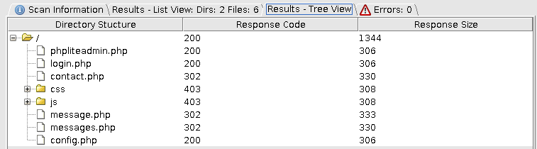

# Rapport étude de menaces

## Introduction


## Décrire le système 

### Data Flow Diagram


### Identifier ses biens 

Dans le monde d'aujourd'hui, une chose qui prend beaucoup de valeur, c'est les données. Dans une application comme celle-ci, qui pourrait gérer quelques dizaine d'utilisateurs. Si leurs données venaient à se faire voler, cela aurait des conséquences directes et indirects sur les développeurs. 

#### Informations de login 

L'un des biens qui est vraiment sensible pour notre application est les données de connexion  des utilisateurs et des administrateurs de l'application. Si un ou des utilisateurs utilisent le même pseudo et mot de passe pour plusieurs applications, ce qui est généralement le cas, cela permettrait à un attaquant de tenter des mouvements latéraux sur d'autres site où l'utilisateur a aussi un compte.

#### Le contenu des messages

Les messages peuvent être de nature assez sensible. Si on prend le contexte de l'application dans une entreprise, cela peut vite devenir délicat si des messages fuites. Des données sensibles sur des clients, l'infrastructure peut compromettre la réputation des services de l'entreprise voire même, occasionner des pertes financière. 

### Définir le périmètre de sécurisation

Le périmètre de l'application est destiné à évolué dans contexte clos coupé de l'interaction d'internet. Cela vient principalement de la fonctionnalité assez simple de l'application qui permet à des employés de pouvoir discuter entre eux. Le fait que l'application ne soit pas en contact direct avec le `monde réel` réduis la probabilité d'attaque. 

## Sources de menaces

- Hackers
  - Motivation: gloire, financière, usage d'information pour mouvement latéraux
  - Cible: Tous les éléments actifs permettant d'accéder et de gérer l'application
  - Potentialité: Basse


- Employé mécontent
  - Motivation: revanche, financière
  - Cible: tous éléments pouvant nuire à l'entreprise
  - Potentialité: Haute


- Concurrent
  - Motivation: Vol de secret professionnel dans les messages des employés
  - Cible: base de données des messages via un employé mécontent
  - Potentialité: Moyenne

## Identifier les scénarios d'attaques

---

### Éléments du système attaqué

L'élément attaqué est la gestion de la base de donnée par la page phpLiteAdmin. 

### Motivation

Récupération des hashes (MD5 ou BCrypt) et des noms d'utilisateurs pour faire des mouvements latéraux sur d'autre infrastructure de l'entreprise. Ajout d'utilisateur forgés administrateurs

Deux scénarios d'attaque sont possible dans le cas de notre application.

### Scénario d'attaque 1

cette attaque pourrait être fait par un hacker uniquement car elle nécessite des compétences et des connaissances que nous pourrait pas avoir le restes des attaquants potentiel. la version phpliteadmin, si on arrive à la savoir, contient des vulnérabilité CRSF, HTML et XSS. 

Si on se base sur ce [site](https://www.exploit-db.com/exploits/39714) on pourrait faire un MITM pour modifier les requêtes d'utilisateur authentifier sur la page d'administration. Mais ces attaques sont relativement complexe à mettre en œuvre dans le cadre de notre application.

### Scénario d'attaque 2 

Comme le mot de passe est celui par défaut il est facile pour n'importe quel attaquant potentiel de pouvoir entrer dans la page de gestion. Là ou ça devient plus compliquer c'est de savoir que cette page existe. Pour cela uniquement un hacker peut et veut effectuer cette action. Cela implique de volontairement la chercher à l'aide d'outil comme **DirBuster**, puis d'essayer de brute force la page de login. On voit qu'avec l'outil dirBuster on peut mapper seulement une partie du site, mais cela suffit pour pratiquer une attaque.



 Une fois que nous sommes entré sur la page de gestion, nous pouvons :

- Générer des utilisateurs administrateurs et ainsi pouvoir s'identifier
- récupérer les identifiants des utilisateurs et appliquer **hashcat** ou **john the ripper** sur les Hash afin d'effectuer des mouvements latéraux ou s'identifier sur le site.  Comme on peut le voir ci-dessous les identifiants de l'administrateur ont sans peine été cassé par hashcat. 

```sh
hashcat -a 0 -m 3200 --force ../hashes.txt Passwords/xato-net-10-million-passwords-100000.txt
$2y$10$kt0HoVATSWqcZo5cwWmnz.kuTsWUI5GxOf99AMAk4eGAcC9rnvDwS:admin
```

---

### Éléments du système attaqué

### Motivation

### Scénario d'attaque

---

### Éléments du système attaqué

### Motivation

### Scénario d'attaque

---

### Éléments du système attaqué

### Motivation

### Scénario d'attaque

---


### STRIDE

| Composant de l’application    | spoofing | Tampering | Repudiation | Information disclosure | Dos  | Elevation of privileges |
| ----------------------------- | -------- | --------- | ----------- | ---------------------- | ---- | ----------------------- |
| Data Store - message          |          |           |             | oui                    |      |                         |
| Data Store - userSti          |          |           |             | oui                    |      |                         |
| login                         |          |           |             |                        |      | oui                     |
| accueil utilisateur           |          |           |             |                        |      |                         |
| accueil admin                 |          |           |             |                        |      |                         |
| envoi d'un message            |          |           |             |                        |      |                         |
| recherche utilisateur envoi   |          |           |             | oui                    |      |                         |
| recherche utilisateur admin   |          |           |             | oui                    |      |                         |
| lister utilisateur admin      |          |           |             |                        |      |                         |
| ajouter un compte utilisateur |          |           |             |                        |      |                         |


## Identifier les contre-mesures

### PhpLiteAdmin

Nous avons ajouté un correctif avec la version de phpLiteAdmin 1.9.8.2 qui est la dernière version sortie. Nous avons aussi changer le mot de passe par défaut en **P@ssw0rd**. 

### PHP Version et nginx 

Nous avons remplacé la version de php par la version 7.4.13 qui ne souffre pour l'instant d'aucune vulnérabilité. Nous avons aussi profité de faire la mise à jour du serveur nginx même si la version ne souffrait d'aucune vulnérabilité connue.

## conclusion
