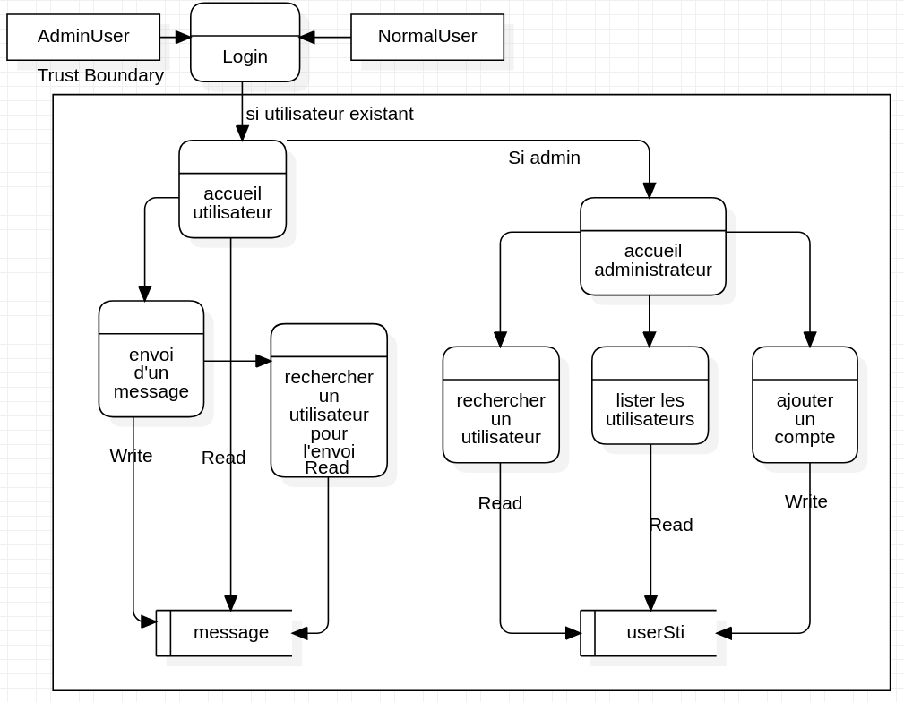
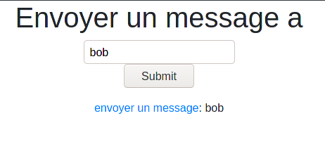

# Rapport étude de menaces

> Quentin Saucy et Jérôme Arn

## Introduction

Dans le cadre de ce travail, une application de messagerie nous a été donné. Le but est de garder les mêmes fonctionnalités ainsi que le même cahier des charges tout en analysant les menaces et en comblant les failles de sécurité de l'infrastructure.

## Décrire le système 

### Data Flow Diagram



### Identifier ses biens 

Dans le monde d'aujourd'hui, une chose qui prend beaucoup de valeur, c'est les données. Dans une application comme celle-ci, qui pourrait gérer quelques dizaines d'utilisateurs, voir des centaines. Si leurs données venaient à se faire voler, cela aurait des conséquences directes et indirectes sur l'entreprise.  

#### Informations de login 

L'un des biens qui est vraiment sensible pour notre application est les données de connexion des utilisateurs et des administrateurs de l'application. Si un ou des utilisateurs utilisent le même pseudo et mot de passe pour plusieurs applications, ce qui est généralement le cas, cela permettrait à un attaquant de tenter des mouvements latéraux sur d'autres sites où l'utilisateur a aussi un compte. De plus, si la politique de mot de passe de l'entreprise n'est pas assez sévère, un schéma de mot de passe pourrait se dessiner pour l'ensemble des employés. 

#### Le contenu des messages

Les messages peuvent être de nature assez sensible. Si on prend le contexte de l'application dans une entreprise, cela peut vite devenir délicat si des messages fuient. Des données sensibles sur des clients, l'infrastructure peut compromettre la réputation des services de l'entreprise voire même, occasionner des pertes financières. 

### Définir le périmètre de sécurisation

Le périmètre de l'application est destiné à évolué dans un contexte clos coupé de l'interaction d'Internet. Cela vient principalement de la fonctionnalité assez simple de l'application qui permet à des employés de pouvoir discuter entre eux. Le fait que l'application ne soit pas en contact direct avec le `monde réel` réduis la probabilité d'attaque. 

## Sources de menaces

- Hackers
  - Motivation : gloire, financière, usage d'information pour des mouvements latéraux
  - Cible : Tous les éléments actifs permettant d'accéder et de gérer l'application
  - Potentialité : Basse


- Employé mécontent
  - Motivation: revanche, financière
  - Cible: tous éléments pouvant nuire à l'entreprise
  - Potentialité: Haute


- Concurrent
  - Motivation: Vol de secret professionnel dans les messages des employés
  - Cible: base de données des messages via un employé mécontent
  - Potentialité: Moyenne

## Identifier les scénarios d'attaques

Pour chaque scénarios, nous avons fait un calcul des risques avec l'outil de l'[OWASP](https://www.security-net.biz/files/owaspriskcalc.html).  

---

### Éléments du système attaqué Version phpLiteAdmin

L'élément attaqué est la gestion de la base de donnée par la page phpLiteAdmin. 

### Motivation

Récupération des hashes (MD5 ou BCrypt) et des noms d'utilisateurs pour faire des mouvements latéraux sur d'autres infrastructures de l'entreprise. Ajout forgé d'utilisateur avec des privilèges administrateurs

Deux scénarios d'attaque sont possibles dans le cas de notre application.

#### Scénario d'attaque 1

Cette attaque pourrait être fait par un hacker uniquement, car elle nécessite des compétences et des connaissances que nous pourrait pas avoir le restes des attaquants potentiel. La version phpliteadmin, si on arrive à la savoir, contient des vulnérabilité CRSF, HTML et XSS. 

Si on se base sur ce [site](https://www.exploit-db.com/exploits/39714) on pourrait faire un MITM pour modifier les requêtes d'utilisateur authentifié sur la page d'administration. Mais ces attaques sont relativement complexe à mettre en œuvre dans le cadre de notre application.

Score de risque : Probabilité **Medium** et un risque **High**

#### Scénario d'attaque 2 

Comme le mot de passe est celui par défaut, il est facile pour n'importe quel attaquant potentiel de pouvoir entrer dans la page de gestion. Là ou ça devient plus compliquer, c'est de savoir que cette page existe. Pour cela, uniquement un hacker peut et veut effectuer cette action. Cela implique de volontairement la chercher à l'aide d'outil comme **DirBuster**, puis d'essayer de brute force la page de login. On voit qu'avec l'outil dirBuster on peut mapper seulement une partie du site, mais cela suffit pour pratiquer une attaque.


 Une fois que nous sommes entré sur la page de gestion, nous pouvons :

- Générer des utilisateurs administrateurs et ainsi pouvoir s'identifier
- récupérer les identifiants des utilisateurs et appliquer **hashcat** ou **john the ripper** sur les Hash afin d'effectuer des mouvements latéraux ou s'identifier sur le site.  Comme on peut le voir ci-dessous les identifiants administrateurs ont sans peine été cassé par hashcat. 

```sh
hashcat -a 0 -m 3200 --force ../hashes.txt Passwords/xato-net-10-million-passwords-100000.txt
$2y$10$kt0HoVATSWqcZo5cwWmnz.kuTsWUI5GxOf99AMAk4eGAcC9rnvDwS:admin
```

Score de risque : Probabilité **High** et un risque **High**

---

### Éléments du système attaqué : Version PHP et NGINX

L'élément attaqué ici serait l'infrastructure php dans sa globalité.

#### Motivation

Mettre principalement l'application hors service pour les employés.

#### Scénario d'attaque

Si l'on se fie à ce [site](https://www.cvedetails.com/vulnerability-list.php?vendor_id=74&product_id=128&version_id=164957&page=1&hasexp=0&opdos=0&opec=0&opov=0&opcsrf=0&opgpriv=0&opsqli=0&opxss=0&opdirt=0&opmemc=0&ophttprs=0&opbyp=0&opfileinc=0&opginf=0&cvssscoremin=0&cvssscoremax=0&year=0&cweid=0&order=1&trc=101&sha=d8cb459be2a570e543cd95cce804c67332d729a8) la version de php que nous avons actuellement est principalement vulnérable aux DDos et aux Dos, si on prend les scores CVSS les plus élevés. Cela implique que si un Hacker venait à avoir accès au réseau de l'entreprise, il pourrait effectuer une de ces attaques sur la messagerie. 

Score de risque : Probabilité **Medium** et un risque **Medium**

---

### Éléments du système attaqué : Robustesse Chiffrement des mots de passe 

L'élément attaqué ici serait la qualité des mots de passe.

#### Motivation

Obtenir les mots de passe en clair pour pouvoir devenir administrateur du site et potentiellement administrateur du serveur.

#### Scénario d'attaque

Un attaquant trouve un accès privilégié aux hash des mots de passe par n'importe quel moyen. Dans cette attaque, nous considérerons une attaque SQL. Une fois la liste des hash de mots de passe obtenu en offline, il est possible de trouver des collisions dans le système de hash MD5.

```sql
'UNION select username, password from userSti;#
```

Le resultat est peu lisible puisque le premier paramètre est inscrit dans l'URL du lien et le mot de passe est affiché. Toutefois, cela permet de récupérer l'information pour pouvoir casser le hash en offline

```html
 <p> <a href="writeMessage.php?id=admin"> envoyer un message</a>: 21232f297a57a5a743894a0e4a801fc3</p>
```


Score de risque : Probabilité **Medium** et un risque **Medium**


----

### Éléments du système attaqué : Credentials par défaut

L'élément attaqué ici est la faiblesse des choix des mots de passes

#### Motivation

Obtenir un accès à des comptes administrateurs

#### Scénario d'attaque

Un attaquant cherche des credentials qu'un utilisateur n'ayant pas pris le temps de modifier. `admin/admin | admin/passsword`...

---

### Éléments du système attaqué : Élévation de privilèges 

L'élément attaqué ici serait les droits d'accès.

#### Motivation

Obtenir un accès privilégié sans droits d'accès administrateur.

#### Scénario d'attaque

Un attaquant utilise une injection sql permettant d'outrepassé le système de login.

```SQL
' or 1=1;#
```

---

### Éléments du système attaqué : Découverte de l'architecture de la base de données

L'élément attaqué ici est une table particulière dans la base de données


#### Motivation 

Connaitre les tables de la base de données pour pouvoir y recupérer les informations voulues

#### Scénario d'attaque

Un attaquant utilise une injection sql Union sur la page ` contact.php`   pour lister les scripts de générations des tables de la base de données

```sql
'UNION select name,sql from sqlite_master;

```

Le résultat retourné est 

```sql
CREATE TABLE 'message' ('id' integer PRIMARY KEY AUTOINCREMENT, receiptDate DATE NOT NULL, sender integer NULL, receiver integer NULL, sujet varchar (50) NOT NULL, messageBody varchar (500) NOT NULL, CONSTRAINT fk_sender FOREIGN KEY(sender) REFERENCES userSti(id), CONSTRAINT fk_receiver FOREIGN KEY(receiver) REFERENCES userSti(id) )

CREATE TABLE 'userSti' ('id' integer PRIMARY KEY AUTOINCREMENT, username varchar (50) UNIQUE NOT NULL, password varchar (255) NOT NULL, isAdmin INT(1) NOT NULL, isActive INT(1) NOT NULL )
```


---

### Éléments du système attaqué : Social engineering

La trust Zone. 

#### Motivation

Lister des informations auxquelles on a pas accès, se faire créer un utilisateur admin en usant de la crédulité d'un administrateur. 

#### Scénario d'attaque

Afin de prouver notre scénario, nous avons pris le cas d'une CSRF qui afficherait l'utilisateur à qui on veut envoyer un message. Dans notre scénario, l'administrateur, qui est déjà authentifié sur la messagerie, se laisse perturber par un mystérieux mail, lui disant que son grand-oncle qui vivait en Belgique vient  de décéder faisant de lui son unique héritier d'une fortune colossale. Le cabinet d'avocat qui lui a envoyé ce mail, lui indique de cliquer sur le lien présent pour prendre contact avec un de leur conseiller. Voici le lien [Cabinet d'avocat PWN&PWNED ](http://localhost:8080/contact.php?query=bob). Nous admettons volontiers que dans ce cas la CSRF n'est pas très dangereuse. 

Mais on pourrait imaginer que ce lien fasse créer un utilisateur avec une requête POST. Vu la complexité d'une telle requête, cela ne pourrait être l’œuvre que d'un Hacker.



Score de risque : Probabilité **Medium** et un risque **Medium**

---


### STRIDE

| Composant de l’application    | spoofing | Tampering | Repudiation | Information disclosure | Dos  | Elevation of privileges |
| ----------------------------- | -------- | --------- | ----------- | ---------------------- | ---- | ----------------------- |
| Data Store - message          |          |           |             | oui                    |      |                         |
| Data Store - userSti          |          |           |             | oui                    |      |                         |
| login                         |          |           |             |                        |      | oui                     |
| accueil utilisateur           |          |           |             |                        |      |                         |
| accueil admin                 |          |           |             | oui                    |      |                         |
| envoi d'un message            |          | oui       | oui         | oui                    |      |                         |
| recherche utilisateur envoi   |          |           | oui         | oui                    |      |                         |
| recherche utilisateur admin   |          |           | oui         | oui                    |      |                         |
| lister utilisateur admin      |          | oui         | oui         | oui                    |      |                         |
| ajouter un compte utilisateur |          |           | oui         |                        |      |                         |


## Identifier les contre-mesures

### PhpLiteAdmin

Nous avons ajouté un correctif avec la version de phpLiteAdmin 1.9.8.2 qui est la dernière version sortie. Nous avons aussi changer le mot de passe par défaut en **P@ssw0rd**. 

### PHP Version et nginx 

Nous avons remplacé la version de php par la version 7.4.13 qui ne souffre pour l'instant d'aucune vulnérabilité. Nous avons aussi profité de faire la mise à jour du serveur nginx même si la version ne souffrait d'aucune vulnérabilité connue.

### SQL injection

Nous avons remplacé le système d'accès à la base de donnée par des requêtes SQL préparées et paramétrées.

### CSRF

Nous avons rajouté des token anti-CSRF sur les requêtes GET et POST de l'application afin que l'on puisse vérifier que c'est uniquement l'utilisateur qui a fait la manipulation et non pas une requête forgée. Le but est de générer un seul Token de manière sûre pour la session et de vérifier à chaque envoi de formulaire que le token correspond. En parcourant les articles sur le sujet, on peut constater que pour cela certaines communes se rejoignent.

- Générer un hash sûr et assez long, en général minimum 32 bits. 
- Suivant la criticité des applications, on peut générer un hash pour chaque nouvelle page
- Vérifier les deux hash avec '==' ou `hash_equals()`  

## Conclusion

Notre application a amélioré sa sécurité de manière indiscutable au vu d'un certain type d'attaquant tel qu'un employé mécontent ou un Concurrent. Il est fort probable qu'un hacker expérimenté trouve des failles dans notre application. Néanmoins, la pesée des intérêts permet de dire que le risque que cela arrive, donc qu'un attaquant pénètre dans le réseau et qu'il attaque nos biens nous paraît disproportionné face aux efforts qu'il faudrait faire pour devoir l'a partagé.
